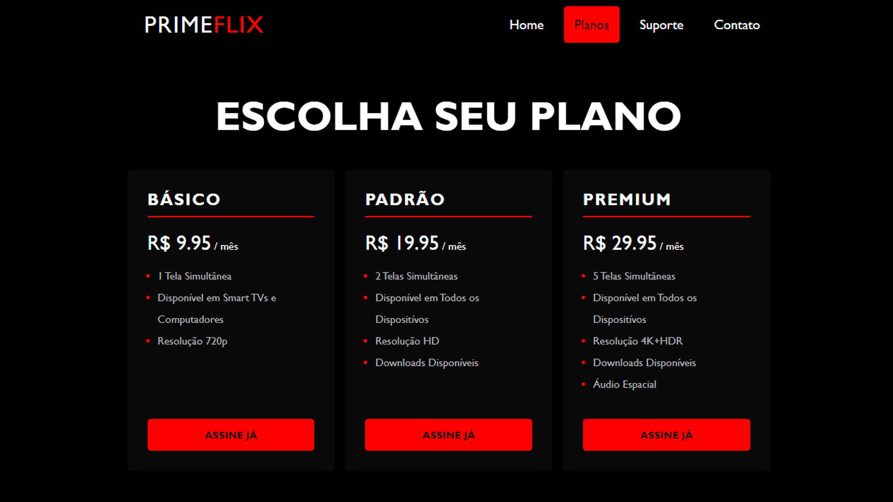

Prime Flix is a study project focused on creating a pricing card-style page, similar to modern subscription-based platforms. This project marks my first steps into CSS, exploring how to design structured and visually appealing pricing sections while enhancing the overall layout and usability.

**[See Page](https://luigineryproject3.netlify.app)**  

